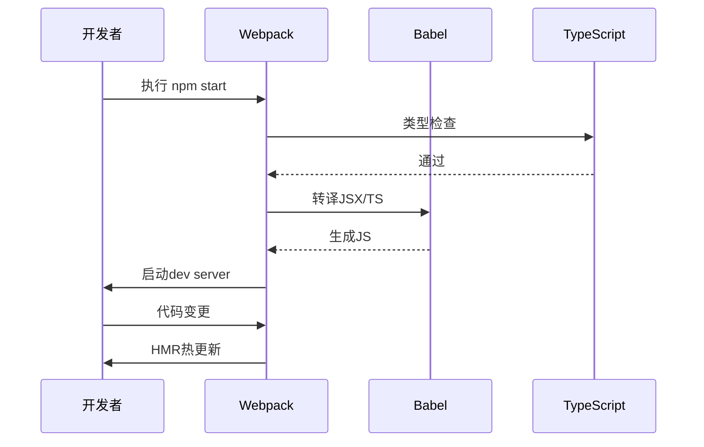

## 54. 如果不使用脚手架，如果用 webpack 构建一个自己的 react 应用

不使用脚手架，手动通过 Webpack 构建 React 应用的完整指南（TypeScript 版）：

---

### 🛠️ **项目初始化**
```bash
mkdir react-webpack-manual
cd react-webpack-manual
npm init -y
git init
```

---

### 📦 **核心依赖安装**
```bash
# React 基础
npm install react react-dom @types/react @types/react-dom

# Webpack 全家桶
npm install webpack webpack-cli webpack-dev-server --save-dev

# Babel 转译
npm install @babel/core babel-loader @babel/preset-env @babel/preset-react @babel/preset-typescript --save-dev

# 样式处理
npm install style-loader css-loader postcss postcss-loader postcss-preset-env sass sass-loader --save-dev

# 其他工具
npm install html-webpack-plugin typescript ts-loader @babel/plugin-transform-runtime --save-dev
```

---

### ⚙️ **Webpack 配置**
#### 1. `webpack.config.ts` (TypeScript 配置)
```typescript
import path from 'path'
import { Configuration } from 'webpack'
import HtmlWebpackPlugin from 'html-webpack-plugin'

const config: Configuration = {
  mode: 'development',
  entry: './src/index.tsx',
  output: {
    path: path.resolve(__dirname, 'dist'),
    filename: 'bundle.[contenthash].js',
    clean: true,
  },
  module: {
    rules: [
      {
        test: /\.(ts|tsx)$/,
        exclude: /node_modules/,
        use: [
          {
            loader: 'babel-loader',
            options: {
              presets: [
                '@babel/preset-env',
                '@babel/preset-react',
                '@babel/preset-typescript'
              ],
              plugins: ['@babel/plugin-transform-runtime']
            }
          }
        ]
      },
      {
        test: /\.scss$/,
        use: [
          'style-loader',
          {
            loader: 'css-loader',
            options: {
              modules: {
                auto: true,
                localIdentName: '[name]__[local]--[hash:base64:5]'
              }
            }
          },
          'postcss-loader',
          'sass-loader'
        ]
      },
      {
        test: /\.(png|svg|jpg|jpeg|gif)$/i,
        type: 'asset/resource'
      }
    ]
  },
  resolve: {
    extensions: ['.tsx', '.ts', '.js'],
    alias: {
      '@': path.resolve(__dirname, 'src')
    }
  },
  plugins: [
    new HtmlWebpackPlugin({
      template: './public/index.html',
      favicon: './public/favicon.ico'
    })
  ],
  devServer: {
    static: {
      directory: path.join(__dirname, 'dist')
    },
    historyApiFallback: true,
    hot: true,
    port: 3000,
    open: true
  }
}

export default config
```

#### 2. `webpack.prod.config.ts` (生产环境扩展)
```typescript
import { merge } from 'webpack-merge'
import baseConfig from './webpack.config'
import MiniCssExtractPlugin from 'mini-css-extract-plugin'
import CssMinimizerPlugin from 'css-minimizer-webpack-plugin'
import TerserPlugin from 'terser-webpack-plugin'

const prodConfig = merge(baseConfig, {
  mode: 'production',
  devtool: 'source-map',
  module: {
    rules: [
      {
        test: /\.scss$/,
        use: [
          MiniCssExtractPlugin.loader,
          'css-loader',
          'postcss-loader',
          'sass-loader'
        ]
      }
    ]
  },
  plugins: [
    new MiniCssExtractPlugin({
      filename: 'styles.[contenthash].css'
    })
  ],
  optimization: {
    minimizer: [
      new TerserPlugin(),
      new CssMinimizerPlugin()
    ],
    splitChunks: {
      chunks: 'all'
    }
  }
})

export default prodConfig
```

---

### 🔧 **辅助配置文件**
#### 1. `tsconfig.json`
```json
{
  "compilerOptions": {
    "target": "ESNext",
    "module": "ESNext",
    "jsx": "react-jsx",
    "baseUrl": "./",
    "paths": {
      "@/*": ["src/*"]
    },
    "strict": true,
    "moduleResolution": "node",
    "esModuleInterop": true,
    "skipLibCheck": true,
    "forceConsistentCasingInFileNames": true
  },
  "include": ["src", "webpack.config.ts"],
  "exclude": ["node_modules"]
}
```

#### 2. `.babelrc`
```json
{
  "presets": [
    "@babel/preset-env",
    "@babel/preset-react",
    "@babel/preset-typescript"
  ],
  "plugins": [
    "@babel/plugin-transform-runtime"
  ]
}
```

#### 3. `postcss.config.js`
```javascript
module.exports = {
  plugins: [
    require('postcss-preset-env')({
      browsers: 'last 2 versions'
    }),
    require('autoprefixer')
  ]
}
```

---

### 📁 **项目结构**
```bash
├── dist/                  # 构建输出目录
├── src/
│   ├── assets/            # 静态资源
│   ├── components/        # 通用组件
│   ├── hooks/             # 自定义Hook
│   ├── styles/            # 全局样式
│   ├── utils/             # 工具函数
│   ├── App.tsx            # 根组件
│   └── index.tsx          # 入口文件
├── public/
│   ├── index.html         # HTML模板
│   └── favicon.ico        # 网站图标
├── package.json
└── tsconfig.json
```

---

### 🚀 **关键文件实现**
#### 1. `public/index.html`
```html
<!DOCTYPE html>
<html lang="zh-CN">
<head>
  <meta charset="UTF-8">
  <meta name="viewport" content="width=device-width, initial-scale=1.0">
  <title>手动搭建React应用</title>
</head>
<body>
  <div id="root"></div>
</body>
</html>
```

#### 2. `src/index.tsx`
```typescript
import React from 'react'
import ReactDOM from 'react-dom/client'
import App from './App'
import './styles/global.scss'

const root = ReactDOM.createRoot(
  document.getElementById('root') as HTMLElement
)

root.render(
  <React.StrictMode>
    <App />
  </React.StrictMode>
)
```

#### 3. `src/App.tsx` (带CSS Modules)
```typescript
import React from 'react'
import styles from './App.module.scss'

const App: React.FC = () => {
  return (
    <div className={styles.container}>
      <h1>手动搭建的React应用</h1>
      <p>基于Webpack + TypeScript</p>
    </div>
  )
}

export default App
```

---

### 📜 **NPM 脚本配置**
```json
{
  "scripts": {
    "start": "webpack serve --config webpack.config.ts",
    "build": "webpack --config webpack.prod.config.ts",
    "type-check": "tsc --noEmit",
    "lint": "eslint src --ext .ts,.tsx",
    "analyze": "webpack-bundle-analyzer dist/stats.json"
  }
}
```

---

### 🔍 **高级优化技巧**
#### 1. 代码分割 (动态导入)
```typescript
// 使用React.lazy + Suspense
const HeavyComponent = React.lazy(() => import('./components/HeavyComponent'))

function App() {
  return (
    <Suspense fallback={<div>Loading...</div>}>
      <HeavyComponent />
    </Suspense>
  )
}
```

#### 2. 性能分析插件
```typescript
// webpack.prod.config.ts
import { BundleAnalyzerPlugin } from 'webpack-bundle-analyzer'

plugins: [
  new BundleAnalyzerPlugin({
    analyzerMode: 'static',
    reportFilename: 'bundle-analysis.html',
    openAnalyzer: false
  })
]
```

#### 3. 环境变量注入
```typescript
// webpack.config.ts
import Dotenv from 'dotenv-webpack'

plugins: [
  new Dotenv()
]

// 使用环境变量
const apiUrl = process.env.API_URL
```

---

### 🛡️ **安全加固方案**
#### 1. CSP 配置
```typescript
// webpack.prod.config.ts
import { DefinePlugin } from 'webpack'

plugins: [
  new DefinePlugin({
    'process.env.CSP_POLICY': JSON.stringify(
      "default-src 'self'; script-src 'self' 'unsafe-inline'"
    )
  })
]
```

#### 2. 敏感信息保护
```bash
# 安装加密插件
npm install webpack-subresource-integrity --save-dev
```

```typescript
import { SubresourceIntegrityPlugin } from 'webpack-subresource-integrity'

output: {
  crossOriginLoading: 'anonymous'
},
plugins: [
  new SubresourceIntegrityPlugin()
]
```

---

### ⚠️ **常见问题解决**
1. **热更新失效**：
   ```typescript
   devServer: {
     hot: true,
     client: {
       overlay: false
     }
   }
   ```

2. **TypeScript 类型报错**：
   ```bash
   npm install @types/webpack @types/webpack-dev-server --save-dev
   ```

3. **路径别名问题**：
   ```json
   // tsconfig.json
   {
     "compilerOptions": {
       "baseUrl": "./",
       "paths": {
         "@/*": ["src/*"]
       }
     }
   }
   ```

---

### 🌟 **完整构建流程**


通过这套配置，你可以获得：
- 完整的 React + TypeScript 开发环境
- 生产级代码优化
- 模块化 CSS 支持
- 高效的开发体验
- 可扩展的架构基础

需要针对特定场景（如微前端集成、SSR支持、测试配置等）的扩展方案吗？可以进一步探讨具体需求。