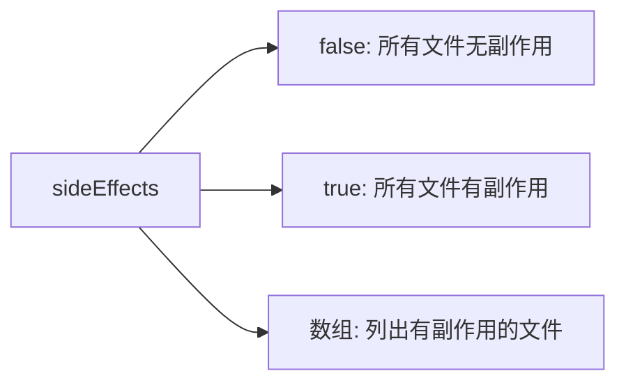

## 56. package.json 里面 sideEffects 属性的作用是啥

`package.json` 中的 `sideEffects` 属性是用于**告知打包工具（如 Webpack、Rollup 等）当前 npm 包或项目中的文件是否有副作用**，从而帮助打包工具进行更高效的 Tree Shaking（树摇优化）。以下是详细解析：

---

### 🌟 **核心作用**


---

### 📌 **关键概念**
#### 1. **什么是副作用？**
- **模块副作用**：当导入一个模块时，除了导出成员外，还会执行其他操作（例如修改全局变量、自动注册组件等）。
- **典型副作用场景**：
  ```javascript
  // 副作用示例：导入时自动注册全局组件
  import 'vue-global-component'
  ```

#### 2. **Tree Shaking 机制**
- 打包工具会静态分析代码，移除未被使用的导出（Dead Code）。
- 若模块被标记为无副作用，即使未被使用也会被安全移除。

---

### 🛠️ **配置示例**
#### 1. **所有文件无副作用（推荐库使用）**
```json
{
  "sideEffects": false
}
```
- **效果**：打包工具会激进地移除所有未使用的导出。

#### 2. **特定文件有副作用**
```json
{
  "sideEffects": [
    "**/*.css",
    "**/*.scss",
    "./src/polyfill.js"
  ]
}
```
- **效果**：仅对列出的文件保留副作用，其他文件参与 Tree Shaking。

#### 3. **所有文件有副作用（保守方案）**
```json
{
  "sideEffects": true
}
```
- **效果**：禁用 Tree Shaking（不推荐）。

---

### 📦 **不同场景下的最佳实践**
#### 1. **UI 组件库**
```json
{
  "sideEffects": [
    "**/*.css",
    "**/*.scss"
  ]
}
```
- **原因**：样式文件需要被导入但无显式导出。

#### 2. **工具函数库**
```json
{
  "sideEffects": false
}
```
- **原因**：纯函数无副作用。

#### 3. **业务项目**
```json
{
  "sideEffects": [
    "./src/init-analytics.js",
    "**/*.css"
  ]
}
```
- **原因**：需要保留初始化脚本和样式文件。

---

### ⚡ **对构建的影响**
| 配置                | Tree Shaking 强度 | 构建速度 | 输出体积 |
|---------------------|------------------|---------|---------|
| `false`             | 激进              | 最快     | 最小     |
| 指定文件数组        | 保守              | 中等     | 中等     |
| `true`              | 禁用              | 最慢     | 最大     |

---

### 🔍 **实际案例解析**
#### 1. **无副作用配置（lodash-es）**
```json
// lodash-es 的 package.json
{
  "sideEffects": false
}
```
- **效果**：允许按需导入单个函数：
  ```javascript
  import { debounce } from 'lodash-es' // 仅打包 debounce
  ```

#### 2. **有副作用配置（antd）**
```json
// antd 的 package.json
{
  "sideEffects": [
    "dist/**",
    "es/**",
    "lib/**",
    "*.less"
  ]
}
```
- **原因**：需要保留样式文件（.less）的副作用。

---

### ⚠️ **常见误区**
1. **误认为 CSS 需要默认导出**：
   ```javascript
   // 错误！即使没有导出，CSS也需要标记为有副作用
   import './styles.css' // 会被错误移除
   ```

2. **混淆 `sideEffects` 和 `pure` 标注**：
    - `/*#__PURE__*/`：标记单个函数调用无副作用。
    - `sideEffects`：标记整个模块级别。

3. **忘记 Babel 转译影响**：
    - 若使用 Babel 的 `@babel/preset-env`，需设置 `modules: false` 保留 ES 模块语法：
      ```json
      // .babelrc
      {
        "presets": [
          ["@babel/preset-env", { "modules": false }]
        ]
      }
      ```

---

### 🛡️ **安全检测方法**
1. **手动验证副作用**：
   ```bash
   # 使用 webpack 的 test 模式
   npx webpack --mode production --json > stats.json
   ```
   分析输出文件中是否意外移除了必要代码。

2. **使用 rollup-plugin-analyzer**：
   ```javascript
   // rollup.config.js
   import analyze from 'rollup-plugin-analyzer'
   export default {
     plugins: [analyze()]
   }
   ```

---

### 🌐 **浏览器兼容性**
- 仅适用于支持 ES 模块的打包工具：
    - ✅ Webpack 4+
    - ✅ Rollup
    - ✅ Vite
    - ❌ CommonJS 模块系统（需转换）

---

通过合理配置 `sideEffects`，可使项目构建体积减少 **30%-70%**（视代码结构而定）。建议结合 `production` 模式构建和 Bundle Analyzer 插件进行持续优化。