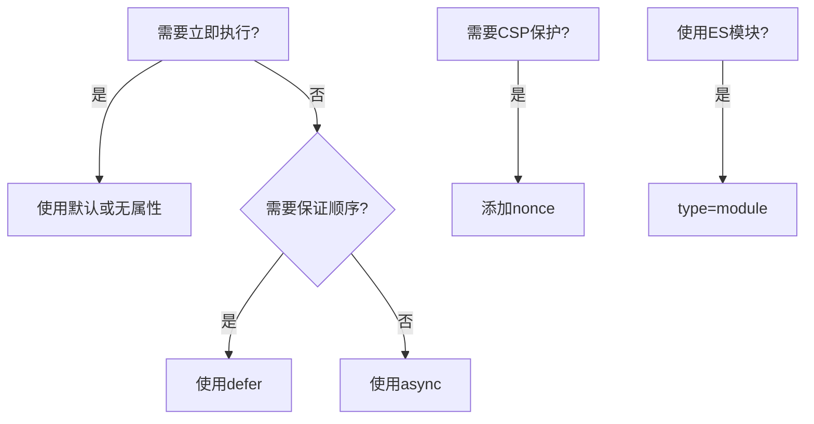

## 57. script 标签上有那些属性，分别作用是啥？

HTML 的 `<script>` 标签是用于嵌入或引用 JavaScript 代码的核心标签，其属性可以精确控制脚本的加载和执行行为。以下是所有主要属性的详细解析（按功能分类）：

---

### 📌 **基础属性**
| 属性 | 值类型 | 作用 | 示例 | 兼容性 |
|------|--------|------|------|--------|
| `src` | URL | 指定外部脚本地址 | `<script src="app.js">` | 所有浏览器 |
| `type` | MIME类型 | 定义脚本类型，默认`text/javascript` | `<script type="module">` | 所有浏览器 |
| `language`(已废弃) | 字符串 | 早期指定脚本语言 | `<script language="JavaScript1.5">` | 不推荐 |

---

### ⚡ **执行控制属性**
| 属性 | 值类型 | 作用 | 示例 | 触发时机 |
|------|--------|------|------|----------|
| `async` | 布尔 | **异步加载**，下载完成后立即执行 | `<script async>` | 下载完成时 |
| `defer` | 布尔 | **延迟执行**，在文档解析后执行 | `<script defer>` | DOMContentLoaded 前 |
| `nomodule` | 布尔 | 仅在不支持 ES模块的浏览器运行 | `<script nomodule>` | 传统浏览器 |

```html
<!-- 经典执行顺序对比 -->
<script src="1.js"></script>          <!-- 阻塞解析，立即执行 -->
<script src="2.js" defer></script>    <!-- 不阻塞，按顺序在DOM就绪后执行 -->
<script src="3.js" async></script>     <!-- 不阻塞，下载完立即执行（顺序不定） -->
```

---

### 🔒 **安全与完整性**
| 属性 | 作用 | 示例 | 说明 |
|------|------|------|------|
| `integrity` | 子资源完整性(SRI)校验 | `integrity="sha256-..."` | 防止CDN劫持 |
| `crossorigin` | 跨域请求配置 | `crossorigin="anonymous"` | CORS相关 |
| `referrerpolicy` | 控制referer头 | `referrerpolicy="no-referrer"` | 隐私控制 |

```html
<script 
  src="https://cdn.example.com/react.js"
  integrity="sha384-oqVuAfXRKap7fdgcCY5uykM6+R9GqQ8K/uxy9rx7HNQlGYl1kPzQho1wx4JwY8wC"
  crossorigin="anonymous"
></script>
```

---

### 🆕 **现代模块系统**
| 属性 | 作用 | 示例 | 说明 |
|------|------|------|------|
| `type="module"` | 声明ES模块 | `<script type="module">` | 支持`import/export` |
| `type="importmap"` | 模块映射表 | `<script type="importmap">` | 控制模块解析 |

```html
<script type="importmap">
{
  "imports": {
    "lodash": "/node_modules/lodash-es/lodash.js"
  }
}
</script>
<script type="module">
  import _ from 'lodash' // 会根据importmap解析
</script>
```

---

### 🛡️ **内容安全策略(CSP)**
| 属性 | 作用 | 示例 | 说明 |
|------|------|------|------|
| `nonce` | 一次性随机数 | `nonce="EDNnf03nceIOfn39fn3e9h3sdfa"` | 匹配CSP头 |
| `data-pagespeed-no-defer` | 禁用Pagespeed优化 | `<script data-pagespeed-no-defer>` | 特定优化控制 |

---

### 📊 **性能优化属性**
| 属性 | 作用 | 示例 | 说明 |
|------|------|------|------|
| `fetchpriority` | 加载优先级 | `fetchpriority="high"` | 控制资源获取优先级 |
| `blocking` | 渲染阻塞声明 | `blocking="render"` | 新标准提案 |

---

### 🌐 **不常用但重要的属性**
| 属性 | 作用 | 示例 | 说明 |
|------|------|------|------|
| `charset` | 字符编码 | `charset="UTF-8"` | 指定脚本编码 |
| `event` | 事件绑定 | `<script event="click" for="btn">` | 已废弃的写法 |

---

### 🚀 **属性组合策略**


---

### ⚠️ **常见问题解答**
**Q: async 和 defer 哪个先执行？**
A: 无固定顺序，async 可能在 defer 之前或之后执行，取决于下载完成时间。

**Q: 动态插入的 script 默认是什么行为？**
```javascript
const script = document.createElement('script')
script.src = 'file.js'
document.head.appendChild(script) // 默认相当于async
```

**Q: 为什么现代项目推荐 type="module"？**
- 自动获得 defer 行为
- 支持严格的CSP
- 更好的静态分析

**Q: 如何实现优雅降级？**
```html
<script type="module" src="modern.js"></script>
<script nomodule src="legacy.js"></script>
```

---

### 📈 **浏览器支持统计**
| 特性 | Chrome | Firefox | Safari | Edge |
|------|--------|---------|--------|------|
| `defer` | 100% | 100% | 100% | 100% |
| `async` | 100% | 100% | 100% | 100% |
| `type=module` | 100% | 100% | 15+ | 80+ |
| `nomodule` | 100% | 100% | 15+ | 80+ |

---

通过合理组合这些属性，可以精确控制脚本的加载时机、执行顺序和安全策略，这对现代Web应用的性能优化至关重要。需要针对特定场景（如SSR、微前端）的详细配置建议吗？