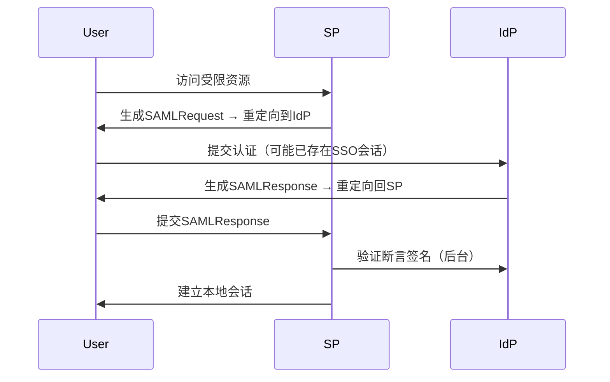
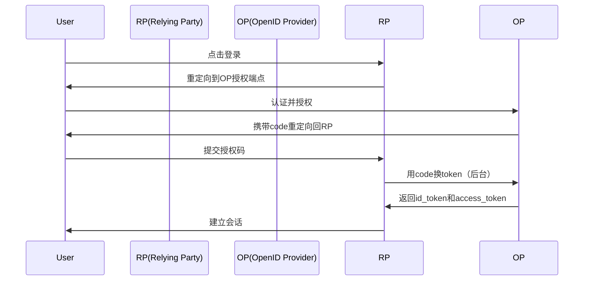

## 60-1. 单点登录具体实现

以下是针对 **SAML 2.0** 和 **OIDC (OpenID Connect)** 的详细实现示例，包含完整代码和关键流程说明：

---

### 🔐 **SAML 2.0 企业级实现（Node.js + Express）**
#### 1. **SP (Service Provider) 配置**
```typescript
import { SamlConfig, Strategy } from 'passport-saml'
import passport from 'passport'

// SAML 配置
const samlConfig: SamlConfig = {
  entryPoint: 'https://sso.example.com/adfs/ls/',  // IdP登录入口
  issuer: 'https://app.example.com/saml/metadata', // SP唯一标识
  callbackUrl: 'https://app.example.com/saml/callback',
  cert: fs.readFileSync('./idp-public-cert.pem'),  // IdP的公钥证书
  privateKey: fs.readFileSync('./sp-private-key.pem'), // SP的私钥
  signatureAlgorithm: 'sha256',
  identifierFormat: 'urn:oasis:names:tc:SAML:2.0:nameid-format:persistent'
}

// Passport 策略
passport.use(new Strategy(samlConfig, (profile, done) => {
  // 验证SAML断言后的用户信息
  return done(null, {
    id: profile.nameID,
    email: profile['http://schemas.xmlsoap.org/ws/2005/05/identity/claims/emailaddress']
  })
}))

// 元数据端点（供IdP获取SP配置）
router.get('/saml/metadata', (req, res) => {
  const strategy = passport._strategy('saml')
  res.type('application/xml')
  res.send(strategy.generateServiceProviderMetadata(fs.readFileSync('./sp-public-cert.pem')))
})
```

#### 2. **登录路由处理**
```typescript
// 发起SAML认证请求
router.get('/saml/login', 
  passport.authenticate('saml', {
    failureRedirect: '/login',
    failureFlash: true
  })
)

// SAML断言回调
router.post('/saml/callback',
  passport.authenticate('saml', { 
    failureRedirect: '/login',
    session: true 
  }),
  (req, res) => {
    res.redirect('/dashboard')
  }
)
```

#### 3. **关键SAML流程**


#### 4. **安全注意事项**
- **强制验证断言签名**：防止伪造响应
- **校验`InResponseTo`**：防止重放攻击
- **断言有效期**：通常设置为3-5分钟

---

### 🔑 **OIDC (OpenID Connect) 实现（TypeScript + Express）**
#### 1. **客户端配置**
```typescript
import { Issuer, Strategy } from 'openid-client'

// 动态发现OIDC配置
const googleIssuer = await Issuer.discover('https://accounts.google.com')

// 创建客户端实例
const client = new googleIssuer.Client({
  client_id: 'CLIENT_ID',
  client_secret: 'CLIENT_SECRET',
  redirect_uris: ['https://app.example.com/oidc/callback'],
  response_types: ['code'],
  scope: 'openid email profile'
})

// Passport策略
passport.use('oidc', new Strategy({ client }, (tokenSet, done) => {
  // 解析ID Token
  const claims = tokenSet.claims()
  done(null, {
    id: claims.sub,
    email: claims.email
  })
}))
```

#### 2. **认证路由**
```typescript
// 初始化登录
router.get('/oidc/login', (req, res, next) => {
  const authUrl = client.authorizationUrl({
    code_challenge: generatePKCECodeChallenge(), // PKCE增强安全
    code_challenge_method: 'S256',
    state: req.session.state = crypto.randomBytes(16).toString('hex')
  })
  res.redirect(authUrl)
})

// 处理回调
router.get('/oidc/callback', async (req, res, next) => {
  // 验证state参数
  if (req.query.state !== req.session.state) {
    return res.status(401).send('Invalid state')
  }

  const params = client.callbackParams(req)
  const tokenSet = await client.callback(
    'https://app.example.com/oidc/callback',
    params,
    { code_verifier: getStoredCodeVerifier() }
  )

  // 使用access_token获取用户信息
  const userInfo = await client.userinfo(tokenSet.access_token!)
  req.session.user = userInfo
  res.redirect('/')
})
```

#### 3. **OIDC 核心流程**


#### 4. **关键安全措施**
- **PKCE (Proof Key for Code Exchange)**
  ```typescript
  // 生成PKCE验证参数
  import { generateCodeVerifier, generateCodeChallenge } from 'pkce-gen'

  const verifier = generateCodeVerifier(64)
  const challenge = await generateCodeChallenge(verifier)
  ```
- **ID Token验证**
  ```typescript
  const claims = jwt.decode(id_token) as JwtPayload
  assert(claims.iss === 'https://accounts.google.com')
  assert(claims.aud === 'CLIENT_ID')
  assert(claims.exp > Date.now() / 1000)
  ```

---

### 🛠️ **生产级优化建议**
#### **SAML 2.0**
1. **元数据自动更新**
   ```typescript
   // 定时从IdP获取最新元数据
   import { SamlMetadataUpdate } from 'saml-metadata-update'

   const updater = new SamlMetadataUpdate({
     url: 'https://sso.example.com/FederationMetadata/2007-06/FederationMetadata.xml',
     refreshInterval: 3600 // 每小时更新
   })
   ```
2. **审计日志**
   ```typescript
   passport.deserializeUser((user, done) => {
     logAuditEvent(`User ${user.id} authenticated via SAML`)
     done(null, user)
   })
   ```

#### **OIDC**
1. **Token自动刷新**
   ```typescript
   // 在access_token过期前刷新
   setInterval(async () => {
     if (tokenSet.expired()) {
       tokenSet = await client.refresh(tokenSet.refresh_token!)
     }
   }, 300000) // 每5分钟检查
   ```
2. **前端静默续期**
   ```html
   <!-- 隐藏iframe实现无感刷新 -->
   <iframe src="https://auth.example.com/silent-renew.html" 
           style="width:0;height:0;border:0;border:none"></iframe>
   ```

---

### ⚠️ **常见问题解决方案**
| 问题 | SAML 方案 | OIDC 方案 |
|------|-----------|-----------|
| **跨域会话失效** | 设置`SameSite=None; Secure` Cookie | 使用`prompt=none`静默认证 |
| **属性映射不一致** | 配置SAML Attribute映射规则 | 自定义scope `profile:custom` |
| **多IdP集成** | 元数据聚合 + 实体ID区分 | 动态客户端注册 |

---

如果需要更具体的某场景实现（如**SAML SLO（单点登出）**或**OIDC RP-Initiated Logout**），可以进一步展开说明！