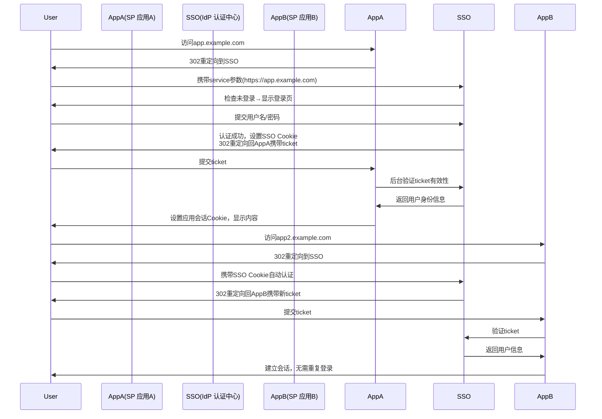

## 60. 单点登录是是什么，具体流程是什么

单点登录（Single Sign-On, SSO）是一种身份认证机制，允许用户通过**一次登录**访问多个相互信任的应用系统。以下是深度技术解析和完整流程说明：

---

### 🌟 **SSO 核心价值**
| 优势 | 说明 |
|------|------|
| **用户体验** | 用户只需记住1套凭证，无需重复登录 |
| **安全集中** | 统一的安全策略和密码强度要求 |
| **管理高效** | 账号开通/禁用只需在SSO平台操作 |
| **风险可控** | 所有系统的登录行为可集中审计 |

---

### 🔑 **核心术语**
| 术语 | 说明 |
|------|------|
| **IdP (Identity Provider)** | 身份认证中心（如公司SSO服务器） |
| **SP (Service Provider)** | 依赖IdP的服务提供方（如内部系统） |
| **Token** | 身份凭证（如JWT、SAML断言） |
| **CAS (Central Authentication Service)** | 经典SSO协议 |

---

### 🔄 **SSO 主流协议对比**
| 协议 | 适用场景 | 特点 | 示例 |
|------|----------|------|------|
| **OAuth 2.0** | 互联网应用 | 授权而非认证，需结合OpenID Connect | 微信登录 |
| **SAML 2.0** | 企业级应用 | XML格式，安全性高 | 公司ADFS集成 |
| **CAS** | 传统Web系统 | 简单重定向流程 | 大学图书馆系统 |
| **Kerberos** | 内网系统 | 无需前端参与，依赖票据 | Windows域认证 |

---

### 📜 **经典CAS流程详解（含时序图）**


---

### 🔐 **关键安全措施**
1. **Token防篡改**
    - 使用JWT时必加签名（HS256/RS256）
    - SAML断言需XML数字签名
2. **通道安全**
    - 强制HTTPS
    - 禁用HTTP重定向
3. **时效控制**
   ```typescript
   // JWT 有效期示例
   const token = jwt.sign({
     user: 'admin',
     exp: Math.floor(Date.now() / 1000) + 300 // 5分钟过期
   }, 'SECRET_KEY')
   ```
4. **CSRF防护**
    - 使用state参数校验请求来源
    - 同站Cookie设置`SameSite=Strict`

---

### 💻 **OAuth 2.0 + OpenID Connect 实现SSO**
```typescript
// Express 实现OAuth2.0授权码流程
import { AuthorizationCode } from 'simple-oauth2'

const client = new AuthorizationCode({
  client: {
    id: 'CLIENT_ID',
    secret: 'CLIENT_SECRET'
  },
  auth: {
    tokenHost: 'https://sso.example.com',
    authorizePath: '/oauth/authorize',
    tokenPath: '/oauth/token'
  }
})

// 生成授权链接
router.get('/login', (req, res) => {
  const authorizationUri = client.authorizeURL({
    redirect_uri: 'https://app.example.com/callback',
    scope: 'openid profile', // OpenID Connect scope
    state: crypto.randomBytes(16).toString('hex')
  })
  res.redirect(authorizationUri)
})

// 处理回调
router.get('/callback', async (req, res) => {
  const token = await client.getToken({
    code: req.query.code,
    redirect_uri: 'https://app.example.com/callback'
  })
  req.session.ssoToken = token.token.access_token
  res.redirect('/dashboard')
})
```

---

### 🛡️ **企业级SSO架构示例**
```
┌─────────────────┐     ┌─────────────┐     ┌─────────────┐
│  员工终端设备    │────>│ 反向代理层  │────>│  SSO认证中心 │
└─────────────────┘     └─────────────┘     └─────────────┘
       ↑                                         ↓
       │       ┌─────────────┐        ┌──────────────────┐
       └───────│ 证书认证    │        │  LDAP/AD目录服务 │
               └─────────────┘        └──────────────────┘
                       ↓
               ┌─────────────┐
               │  MFA服务    │
               └─────────────┘
```

---

### ⚠️ **SSO实施常见问题**
1. **Cookie域限制**
    - 解决方案：设置父级域Cookie
      `Set-Cookie: sso_token=xyz; Domain=.example.com; Path=/`

2. **跨域问题**
    - 使用CORS或JSONP（老旧系统）
    - 现代方案：OAuth2.0 + PostMessage

3. **协议混合风险**
    - 禁止：SAML 1.0 + 弱加密算法
    - 推荐：SAML 2.0 + AES-256

4. **会话同步登出**
   ```typescript
   // 全局登出实现
   router.post('/logout', (req, res) => {
     broadcastLogout(req.user.id) // 通知所有SP
     destroySSOSession(req.cookies.sso_token)
     res.clearCookie('sso_token').redirect('/goodbye')
   })
   ```

---

### 📊 **SSO协议选型指南**
| 场景 | 推荐协议 | 工具链 |
|------|----------|--------|
| 新开发Web应用 | OAuth2.0 + OIDC | Keycloak/Auth0 |
| 传统企业系统集成 | SAML 2.0 | ADFS/Okta |
| 移动端SSO | OAuth2.0 PKCE | AppAuth SDK |
| 内部微服务 | JWT + API网关 | Kong/Ory Hydra |

---

### 🔮 **未来趋势**
1. **无密码认证**：WebAuthn标准集成
2. **分布式身份**：DID（Decentralized Identity）
3. **持续认证**：行为生物特征分析