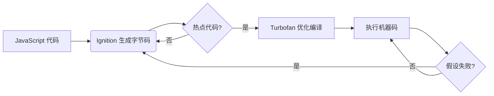

## 78. V8 里面 JIT 是什么？

在 **V8 引擎** 中，**JIT（Just-In-Time）编译** 是提升 JavaScript 执行性能的核心技术。它的核心思想是 **动态编译代码**，而不是直接解释执行。以下是详细解析：

---

## **1. JIT 是什么？**
- **全称**：Just-In-Time（即时编译）。
- **作用**：在代码运行时动态编译 JavaScript 为机器码，显著提升执行速度。
- **对比传统方式**：
    - **解释执行**：逐行翻译代码，效率低（如早期 JavaScript 引擎）。
    - **预编译（AOT）**：提前编译所有代码（如 C++），但灵活性差。
    - **JIT**：结合两者优势，动态编译热点代码。

---

## **2. V8 中的 JIT 实现**
V8 的 JIT 分为多个阶段，逐步优化代码：

### **(1) 基线编译器（Ignition）**
- **功能**：快速生成未优化的字节码（bytecode）。
- **特点**：
    - 启动快，占用内存少。
    - 收集代码执行时的类型反馈（Type Feedback）。
- **示例**：
  ```javascript
  function add(a, b) { return a + b; }
  ```
  Ignition 会生成字节码，并记录 `a` 和 `b` 的类型（如 `number` 或 `string`）。

### **(2) 优化编译器（TurboFan）**
- **触发条件**：当函数被多次调用（热点代码）时。
- **优化策略**：
    - 基于 Ignition 收集的类型反馈，生成高度优化的机器码。
    - 假设类型稳定（如 `a` 和 `b` 始终是 `number`），生成特化代码。
- **去优化（Deoptimization）**：
    - 如果假设失败（如突然传入 `string`），回退到字节码。

### **(3) 内联缓存（Inline Cache, IC）**
- **作用**：加速属性访问（如 `obj.x`）。
- **原理**：
    - 缓存对象的隐藏类（Hidden Class）和属性偏移量。
    - 直接通过偏移量访问，避免多次查找。

---

## **3. JIT 的工作流程**


---

## **4. JIT 的性能优势**
| **场景**               | **解释执行** | **JIT 编译**       |
|------------------------|-------------|--------------------|
| 首次执行               | 慢          | 稍慢（生成字节码） |
| 重复执行（热点代码）    | 慢          | 极快（机器码）     |
| 动态类型处理           | 灵活但慢    | 通过假设优化       |

---

## **5. 实际例子**
### **代码示例**
```javascript
function sum(arr) {
  let total = 0;
  for (let i = 0; i < arr.length; i++) {
    total += arr[i]; // TurboFan 会优化为整数加法
  }
  return total;
}
```
### **优化过程**
1. Ignition 生成字节码，记录 `arr[i]` 是 `number`。
2. TurboFan 编译为机器码，假设 `total` 是整数。
3. 如果 `arr` 中包含字符串，回退到字节码。

---

## **6. JIT 的挑战**
- **内存开销**：保存字节码和机器码占用更多内存。
- **预热时间**：需要运行一段时间才能优化。
- **动态类型**：类型变化会导致去优化（如从 `number` 突然变 `string`）。

---

## **7. 如何写出 JIT 友好代码？**
- **保持类型稳定**：
  ```javascript
  // 差：混合类型
  function add(a, b) { return a + b; }

  // 好：固定类型
  function addNumbers(a: number, b: number) { return a + b; }
  ```
- **避免动态属性删除**：
  ```javascript
  // 差：破坏隐藏类
  delete obj.x;

  // 好：置为 null
  obj.x = null;
  ```
- **使用小而专的函数**：便于 TurboFan 内联优化。

---

## **8. 扩展：其他引擎的 JIT**
| **引擎**   | **JIT 实现**                     |
|------------|----------------------------------|
| SpiderMonkey（Firefox） | Baseline + IonMonkey       |
| JavaScriptCore（Safari） | LLInt + DFG + FTL          |
| Chakra（旧 Edge）       | SimpleJIT + FullJIT        |

---

## **9. 总结**
- **JIT 是 V8 高性能的核心**：通过动态编译热点代码，大幅提升执行速度。
- **关键组件**：Ignition（字节码） + TurboFan（优化编译） + IC（缓存加速）。
- **开发建议**：保持代码类型稳定，避免破坏隐藏类。

通过理解 JIT 的工作原理，可以写出更高效的 JavaScript 代码！ ⚡